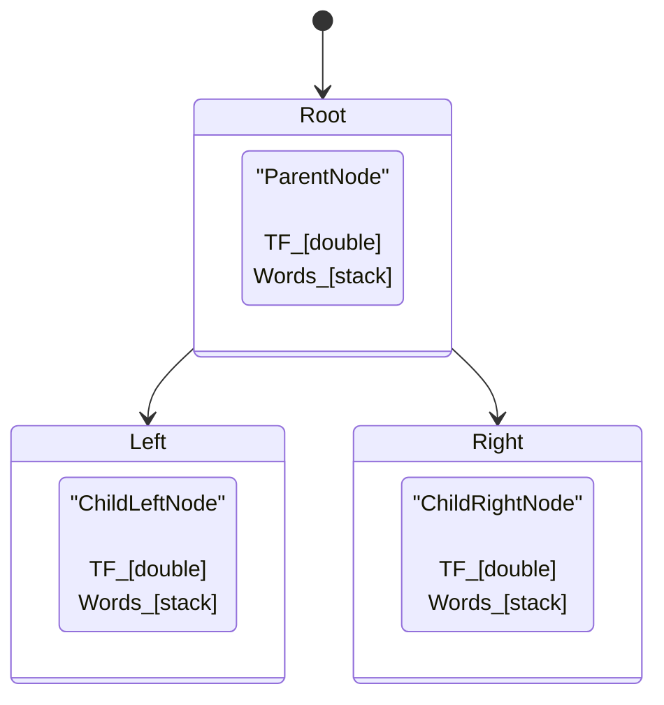
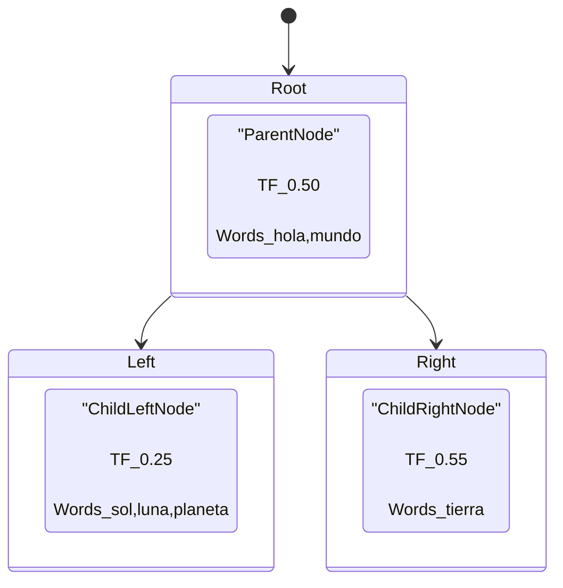
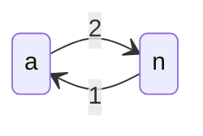

# Caso Práctico 2

| Curso                   | Estructuras de Datos                   |
| :---------------------- | :------------------------------------- |
| Código                  | SC-304                                 |
| Profesor                | Luis Andrés Rojas Matey                |
| Valor                   | 15 %                                   |
| Fecha y hora de entrega | Lunes 1 de diciembre antes de las 6 pm |

<br />

- [Indicaciones generales](#indicaciones-generales)
- [Indicaciones específicas](#indicaciones-específicas)
  - [`input.txt`](#inputtxt)
  - [`clean.txt`](#cleantxt)
  - [`map.txt`](#maptxt)
    - [`CustomQueue.java`](#customqueuejava)
  - [`tree.txt`](#treetxt)
    - [`CustomStack.java`](#customstackjava)
    - [`CustomTree.java`](#customtreejava)
  - [`matrix.csv`](#matrixcsv)
    - [`CustomGraph.java`](#customgraphjava)
- [Entregables](#entregables)
- [Rúbrica de evaluación](#rúbrica-de-evaluación)

<br />

## Indicaciones generales

Este **_Caso Práctico_** consta de un proyecto que ejemplifica el concepto de "recuperación de información textual", el cual utiliza diferentes técnicas para obtener y analizar contenido textual.

Lo primero que debe hacer es copiar esta carpeta (`CP2`), con todo su contenido (incluyendo este archivo `README.md`), a su propio repositorio para que lo trabaje desde allí.

El código fuente del programa consta de ocho archivos en el lenguaje **Java**:

- `Main.java`: aquí se encuentra el método principal (`main`).

- `QueueNode.java`: estructura utilizada por la cola.

- `StackNode.java`: estructura utilizada por la pila.

- `TreeNode.java`: estructura utilizada por el árbol.

- `CustomGraph`: implementación de un grafo dirigido por medio de una matriz de adyacencia.

- `CustomQueue`: implementación de una cola por medio de una lista enlazada simple.

- `CustomStack`: implementación de una pila por medio de una lista enlazada simple.

- `CustomTree`: implementación de un árbol binario de búsqueda.

El objetivo del programa es leer un archivo de texto (`input.txt`) que contiene caracteres en idioma español (así como signos de puntuación) y, a partir de las estructuras antes mencionadas, genere varios archivos de salida:

- `clean.txt`: este archivo es una versión "limpia" del archivo de entrada; es decir, se cambian todas las letras a minúsculas, se quitan las tildes de las vocales, se eliminan lo signos de puntuación y se acorta todo el contenido a una sola línea.

- `map.txt`: este archivo mantiene un mapa (diccionario) de todas las palabras (incluso monosílabos y preposiciones) con los índices de sus ubicaciones en el archivo limpio.

- `tree.txt`: este archivo muestra la información del árbol que contiene los _Term Frequencies_ de las palabras.

- `matrix.csv`: este archivo CSV (_Comma-Separated Values_) contiene la matriz de adyacencia de cada carácter con sus caracteres inmediatos siguientes.

Para lograr el objetivo del programa, es necesario que se hagan ciertas modificaciones a algunos de los códigos fuentes (`.java`), y aquí es donde reside la práctica.

Tomar en cuenta que el programa, aún sin las actualizaciones, debe compilar, por lo que se recomienda indicarle al compilador que procese todos los archivos. Ejemplo:

```bash
$ javac *.java
```

Además, la ejecución del programa (una vez esté terminado) se debe hacer sin argumentos. Una vez se ejecute, lo único que desplegará en la Consola es la cantidad de palabras que procesó del archivo (limpio). Ejemplo:

```bash
$ java Main

Length (words): 2397
```

<br />

## Indicaciones específicas

En esta sección, se explicará en detalle cada paso del programa y lo que se debe modificar para cumplir con el objetivo. Para esto, se va a dividir según cada archivo (de entrada y de salida) en el orden que estos son utilizados o generados.

Es muy importante tener en cuenta que los archivos de salida son generados al final de la ejecución (último paso del programa), por lo que es posible que se deban primero hacer todas las modificaciones para poder probar su comportamiento.

Así mismo, debe acatar lo siguiente:

- No es permitido modificar las implementaciones de los _Nodes_ (`QueueNode`, `StackNode` y `TreeNode`), ni la clase que tiene el método `main` (el archivo `Main.java`).

- No es tampoco permitido agregar, actualizar o eliminar ninguna clase, atributo, constructor o método adicional a lo que se indicará explícitamente. Lo único permitido adicionar es el _Package_ en caso que así lo amerite.

- Los métodos a modificar solo se podrán actualizar en su lógica, no en su tipo de acceso, valor de retorno, nombres o parámetros. En cada método a actualizar aparecerá como comentario la palabra "Actualizar" (`// Actualizar`) como guía de dónde debe agregar su código.

- Tampoco se debe imprimir nada en la Consola manualmente, es decir, no se debe agregar ningún `System.out.print...`.

- No es permitido utilizar los bloques de _Try/Catch/Finally_ (`try {...} catch {...} finally {...}`) para "atrapar" posibles excepciones.

<br />

### `input.txt`

Este es el único archivo que lee el programa una vez se ejecuta. Su contenido puede ser cualquier texto. Se adjunta, de ejemplo, el texto del cuento ['**Algo**' de Hans Christian Andersen](https://es.wikisource.org/wiki/%C2%ABAlgo%C2%BB). Ningún cambio se debe hacer para que esto funcione.

<br />

### `clean.txt`

Este archivo, tal como se indicó anteriormente, es la versión "limpia" del archivo de entrada (`input.txt`). La "limpieza" es automática, por lo que no se debe hacer ninguna modificación para que este archivo se genere correctamente.

<br />

### `map.txt`

Este archivo contiene la información almacenada en el diccionario. Este diccionario es un mapa que contiene las palabras y una cola de índices. Un índice es un valor entero que indica una ubicación en el archivo limpio. Por ejemplo:

| Palabra | Cola de índices  |
| :------ | :--------------- |
| ...     | ...              |
| pedir   | 651              |
| deseaba | 685, 1400        |
| ultimo  | 1323, 1548       |
| persona | 1467             |
| mayor   | 6, 368, 597, 694 |
| ...     | ...              |

<br />

#### `CustomQueue.java`

Para que el archivo `map.txt` sea generado correctamente, se deben implementar los siguientes métodos del archivo `CustomQueue.java`:

- **`enqueue`**: encola un elemento cuyo valor (del _Node_) es de tipo entero (`int`) que contendrá el índice. Para esto, al utilizar una lista enlazada simple, el elemento a encolar se debe ingresar al final de lista.

- **`dequeue`**: desencola un elemento, retornando el valor entero del _Node_ desencolado (`int`) que contiene el índice. Si no hay elementos en la cola, debe retornar un valor de uno negativo (`-1`).

- **`getSize`**: retorna el tamaño (largo) de la cola. Este valor es entero (`int`). Para esto se debe recorrer dicha estructura y contar los elementos que hayan sido encolados.

En el archivo adjunto de ejemplo (`map.txt`), se puede observar que las claves/llaves del diccionario (las palabras) no están ordenadas, pero los valores (índices) de cada palabra sí lo están ya que fueron encolados en orden:

```
...
pedir → 651
deseaba → 685 1400
ultimo → 1323 1548
persona → 1467
mayor → 6 368 597 694
...
```

<br />

### `tree.txt`

Este archivo, tal como se mencionó, es generado a partir del árbol binario que mantiene el _Term Frequency_ (**TF**) de cada palabra. El **TF** es la razón (división) de la cantidad de veces que una palabra aparece en el escrito entre la cantidad de todas las palabras; es decir, para efectos prácticos, es la división del tamaño de cada cola entre el total de palabras que se imprime en la Consola.

Dado que el **TF** de una palabra puede ser compartido (más de una palabra puede tener el mismo **TF**), entonces es necesario mantener todas las palabras que tienen el mismo **TF**. Para esto, se utiliza la pila.

<br />

#### `CustomStack.java`

Este es el archivo que se debe modificar para que la pila funcione correctamente. Para esto, se deben actualizar los siguientes métodos:

- **`push`**: agrega un elemento (en este caso el valor de su _Node_ es de tipo `String`, que corresponde a una palabra) al inicio de la lista.

- **`pop`**: retorna el valor (_String_) del elemento (_Node_) que está en el tope de la pila (el cual equivale a la palabra). Si no hay elementos en la pila, debe retornar un valor nulo (`null`).

- **`size`**: retorna el tamaño (largo) de la pila. Este valor es entero (`int`). Para esto se debe recorrer dicha estructura y contar los elementos que hayan sido apilados.

<br />

#### `CustomTree.java`

La implementación de este árbol binario de búsqueda implica que se tome en cuenta lo que mantiene cada uno de sus _Nodes_ (sus atributos):

- `_tf`: es el **TF**. Este valor es flotante (`double`).
- `_words`: es la pila de palabras que comparten dicho **TF**.
- `_left` y `_right`: las referencias a sus hijos izquierdo y derecho, respectivamente.

Por ejemplo:



Por lo tanto, lo único que se debe modificar es el método privado (`private`) llamado **`insert`**, el cual debe permitir insertar un nodo recursivamente según las siguientes reglas:

- Si el **TF** del nuevo nodo es menor que el del nodo padre, se debe insertar en su subárbol izquierdo (del padre).
- Si el **TF** del nuevo nodo es mayor que el del nodo padre, se debe insertar en su subárbol derecho (del padre).
- Si el **TF** del nuevo nodo es igual que el del nodo padre, se debe insertar en su pila (del padre).

Ejemplo:



Cabe destacar que el archivo generado (`tree.txt`) es un recorrido _In Order_ del árbol, empezando por su raíz, por lo que los valores de los **TF** deben ser mostrados en orden ascendente de forma vertical en el archivo y la pila de palabras de manera horizontal (de lo contrario, indica que los métodos actualizados no fueron implementados correctamente). Por ejemplo (los valores entre paréntesis corresponden al largo de cada pila):

```
...
0.0037546933667083854
 ↳ (2) [ para bien ]

0.004171881518564873
 ↳ (4) [ te pobre pues nada ]

0.00458906967042136
 ↳ (2) [ todos era ]
...
```

<br />

### `matrix.csv`

Esta matriz de adyacencia es generada a partir de los caracteres que están al lado izquierdo y derecho en una misma palabra. El valor almacenado en la matriz será de tipo entero (`int`), esto debido a que guarda la cantidad de veces que se encontraron dichas adyacencias. Las filas corresponden a la primera posición y las columnas a la segunda posición en dicha matriz: `[fila][columna]`.

Así, a modo de ejemplo, con estas palabras: `ana esta en la casa blanca`, la celda en la posición`['a']['n']` de la matriz tendría un `2` debido a que en dos ocasiones la letra `n` está a la derecha de la letra `a` (en las palabras `ana` y `blanca`); mientras que la celda `['n']['a']` tendría un valor de `1`, debido a que solo una vez la letra `a` está a la derecha de la `n` (en la palabra `ana`). Simplificando y mostrando solo las relaciones entre `a` y `n`, su grafo dirigido se vería así:



Parte de esta matriz de ejemplo se vería así:

|       |  a  | ... |  l  | ... |  n  | ... |
| :---: | :-: | :-: | :-: | :-: | :-: | :-: |
| **a** |  0  | ... |  0  | ... |  2  | ... |
|  ...  | ... | ... | ... | ... | ... | ... |
| **l** |  2  | ... |  0  | ... |  0  | ... |
|  ...  | ... | ... | ... | ... | ... | ... |
| **n** |  1  | ... |  0  | ... |  0  | ... |

El archivo generado es de tipo CSV para que la visualización sea más sencilla (cualquier hoja de cálculo debería ser capaz de cargarla, o bien, visualizadores web como [este](https://csv-viewer-online.github.io/)).

<br />

#### `CustomGraph.java`

El método a modificar en este archivo es **`addEdge`**, para que cada celda contenga la cantidad de veces que aparece la adyacencia de ambos caracteres.

<br />

## Entregables

En la raíz de su repositorio, en el _Branch_ `main` (o bien, en el **Campus Virtual**, en la semana 12), debe estar esta carpeta (`CP2`) con únicamente los archivos **Java** (`.java`), con todos los cambios en el código según las especificaciones. Así, no debe contener los archivos de entrada (`input.txt`) ni salida (`clean.txt`, `map.txt`, `tree.txt`, `matriz.csv`), ni el archivo `README.md`, ni los compilados (es decir, excluir también los archivos `.class`).

El código fuente debe incluir, en forma de comentarios, de dónde obtuvo la respuesta/implementación, ya sea con el vínculo (_Link_) de una página o el nombre del chatbot. Ejemplos:

```js
// https://en.wikipedia.org/wiki/Metallic_mean
...
// Gemini
...
```

<br />

## Rúbrica de evaluación

| Rubro                | **Puntos** |
| :------------------- | :--------: |
| **A**. Estructura    |     3      |
| **B**. `CustomQueue` |     3      |
| **C**. `CustomStack` |     3      |
| **D**. `CustomTree`  |     3      |
| **E**. `CustomGraph` |     3      |
| **Total**            |   **15**   |

<br />
