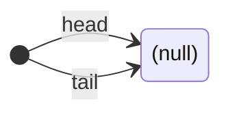
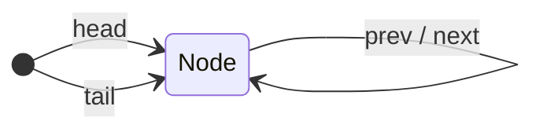
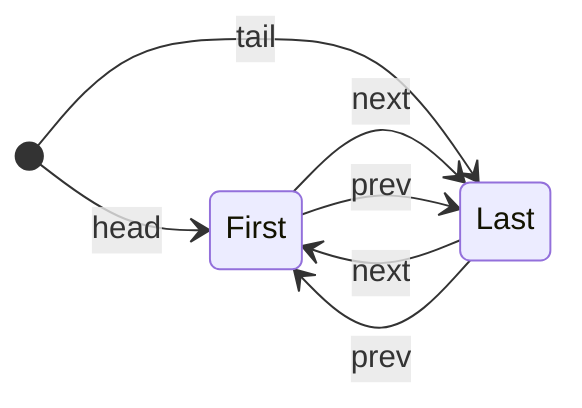
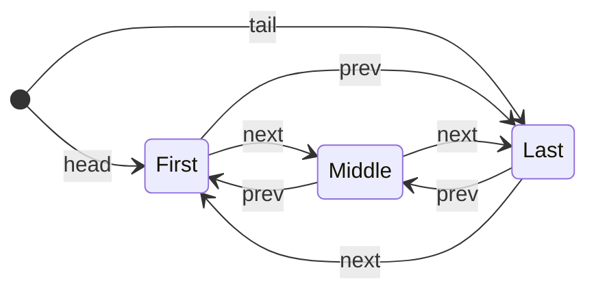
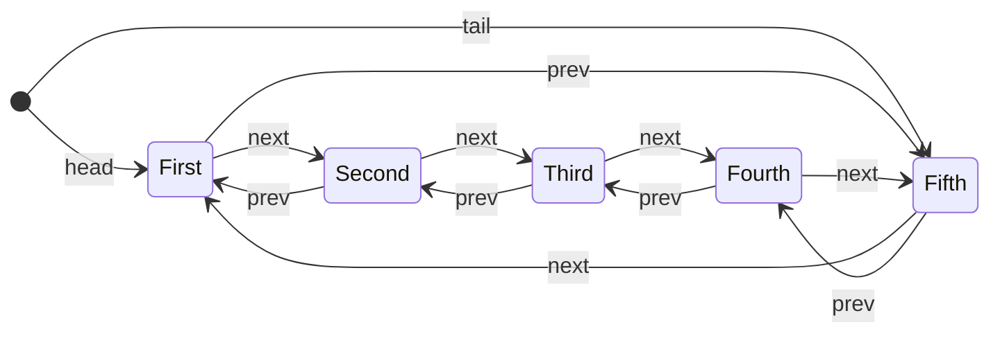

# Práctica Programada 3

| Curso                   | Estructuras de Datos                   |
| :---------------------- | :------------------------------------- |
| Código                  | SC-304                                 |
| Profesor                | Luis Andrés Rojas Matey                |
| Valor                   | 5 %                                    |
| Fecha y hora de entrega | Lunes 3 de noviembre antes de las 6 pm |

<br />

- [Introducción](#introducción)
- [Objetivo](#objetivo)
- [Especificaciones funcionales](#especificaciones-funcionales)
- [Especificaciones técnicas](#especificaciones-técnicas)
- [Entregables](#entregables)
- [Evaluación](#evaluación)

<br />

## Introducción

Las estructuras de datos de tipo listas son muy utilizadas en la informática. Las hay de diferentes tipos e implementaciones.

<br />

## Objetivo

Familiarizarse con la estructura de lista (_List_) en el lenguaje de programación **Java**, creando un programa capaz de trabajar con una lista circular doblemente enlazada usando nodos con valores naturales entre cero y nueve, creados aleatoriamente.

<br />

## Especificaciones funcionales

Utilizando la _Class_ genérica `ListDoublyCircular`, implemente correctamente los siguientes métodos especificados por la _Interface_ genérica `ListInterface`:

- `addFirst`: agrega un nodo al inicio de la lista. No tiene restricción de capacidad.

- `addLast`: agrega un nodo al final de la lista. No tiene restricción de capacidad.

- `removeFirst`: elimina el primer nodo de la lista retornando su valor (`data`). Si la lista está vacía, debe retornar `null`.

- `removeLast`: elimina el último nodo de la lista retornando su valor (`data`). Si la lista está vacía, debe retornar `null`.

Para lograr el objetivo, tome en cuenta lo siguiente:

- Todos los demás métodos de dicha _Class_ ya están correctamente implementados, por lo que no debe modificarlos.

- Al ser una lista circular doblemente enlazada, esta utiliza un nodo (_Class_ genérica `NodeDoubly`) que mantiene el valor (en el atributo `data`), así como los punteros al nodo anterior (atributo `prev`) y al siguiente (atributo `next`). La implementación de dicho nodo tampoco puede ser modificada.

- La lista mantiene en todo momento dos referencias (atributos):

  - `head`: nodo inicial/primero.
  - `tail`: nodo final/último.

- La lista vacía tiene sus referencias (`head` y `tail`) con valores nulos (`null`), tal como se puede ver en el constructor de dicha _Class_; sin embargo, los punteros de los nodos (`prev` y `next`) de sus referencias (`head` y `tail`) no pueden ser nulas (`null`). Ejemplo:



- Cuando la lista tiene un único elemento (una sola instancia de un nodo), sus referencias (`head` y `tail`) apuntan a dicho nodo. Así mismo, los punteros del nodo (`prev` y `next`) apuntan también al mismo nodo. Ejemplo:



- Cuando la lista tiene dos elementos (dos nodos), la referencia `head` apunta al nodo inicial, mientras que la referencia `tail` apunta al último nodo. Así mismo, los punteros de dichos nodos (`prev` y `next`) apuntan al otro nodo. Ejemplo:



- Ejemplos de cuando la lista tiene más de dos elementos (nodos):





- En resumen, se puede notar que siempre el puntero `prev` del primer nodo de la lista (referenciado por `head`) apunta al último nodo de la lista (`tail`). De igual manera, el puntero `next` del último nodo (`tail`) siempre apunta al primer nodo (`head`).

Una vez los métodos a implementar estén funcionando correctamente, la aplicación debe ejecutarse con un parámetro `n`, el cual será un número natural mayor o igual que cero. La ejecución (lo ya incluido en el método `main`) entonces efectúa lo siguiente:

- Crea `n * 4` números aleatorios en un rango entre cero y nueve para agregarlos a lista: `n * 2` como nodos iniciales (`addFirst`) y `n * 2` como finales (`addLast`).

- Elimina `n * 2` elementos de la lista: `n` de manera inicial (`removeFirst`) y `n` de forma final (`removeLast`).

- Elimina el resto de elementos de la lista utilizando los mísmos métodos (`removeFirst` y `removeLast`), pero invocándolos más veces que la cantidad remanente de nodos, para poder verificar si la implementación de los métodos toma en cuenta dichos escenarios.

- Imprime en la Consola cierta información de cada paso:
  - `List {...}: [...]`: este es un arreglo hecho con [ArrayDeque](https://docs.oracle.com/en/java/javase/21/docs/api/java.base/java/util/ArrayDeque.html) para que se ayude a verificar si su lista está comportándose igual.
  - `Size`: el tamaño o largo de su lista; es decir, la cantidad de nodos en ella.
  - `Empty`: _Boolean_ que indica si su lista está vacía.
  - `First`: el primer elemento (valor del nodo en `data`) de su lista.
  - `Last`: el último elemento (valor del nodo en `data`) de su lista.
  - `Reverse`: su lista impresa en reversa, es decir, desde el último (referenciado por `tail`) hasta el primero (`head`), utilizando el puntero del nodo `prev` para recorrerla.
  - `Print`: imprime su lista de nodos (valores en `data`) de manera vertical desde el primero (`head`) hasta el último (`tail`), indicando el nodo anterior (`prev`) y el nodo siguiente (`next`), así: **anterior ⇄ | actual | ⇄ siguiente**.

Ejemplo de ejecución con `n = 2` (recuerde que los números naturales son aleatorios):

```
$ java ListDoublyCircular 2

List {added: n * 4}: [2, 1, 6, 6, 7, 0, 6, 8]
 ↳ Size: 8
 ↳ Empty: false
 ↳ First: 2
 ↳ Last: 8
 ↳ Reverse: | 8 | 6 | 0 | 7 | 6 | 6 | 1 | 2 |
 ↳ Print:
        8 ⇄ | 2 | ⇄ 1
        2 ⇄ | 1 | ⇄ 6
        1 ⇄ | 6 | ⇄ 6
        6 ⇄ | 6 | ⇄ 7
        6 ⇄ | 7 | ⇄ 0
        7 ⇄ | 0 | ⇄ 6
        0 ⇄ | 6 | ⇄ 8
        6 ⇄ | 8 | ⇄ 2

List {removed: n * 2}: [6, 6, 7, 0]
 ↳ Size: 4
 ↳ Empty: false
 ↳ First: 6
 ↳ Last: 0
 ↳ Reverse: | 0 | 7 | 6 | 6 |
 ↳ Print:
        0 ⇄ | 6 | ⇄ 6
        6 ⇄ | 6 | ⇄ 7
        6 ⇄ | 7 | ⇄ 0
        7 ⇄ | 0 | ⇄ 6

List {empty}: []
 ↳ Size: 0
 ↳ Empty: true
 ↳ First: null
 ↳ Last: null
 ↳ Reverse:
 ↳ Print:
```

<br />

## Especificaciones técnicas

Tal como se indicó en las especificaciones funcionales, lo único que puede modificar son los cuatro métodos previamente indicados (`addFirst`, `addLast`, `removeFirst`, `removeLast`) de la _Class_ `ListDoublyCircular`.

En caso de que necesite agregar la _Interface_ o _Classes_ a algún _Package_ (por ejemplo, debido al editor/IDE utilizado), puede hacerlo. Sin embargo, no está permitido ninguna otra modificación a la _Interface_ o _Classes_, incluyendo sus atributos y otros métodos.

No se debe imprimir nada en la Consola manualmente, es decir, no se debe agregar ningún `System.out.print...`, ya que lo necesario para mostrar en Consola ya está contenido en los respectivos métodos. Adicionalmente, no es permitido utilizar los bloques de _Try/Catch/Finally_ (`try {...} catch {...} finally {...}`) para "atrapar" posibles excepciones.

La versión para desarrollar la práctica debe ser [**_Java SE 21 & JDK 21_**](https://docs.oracle.com/en/java/javase/21/docs/api/index.html) (_Standard Edition & Java Development Kit version 21)_, la cual es [LTS](<https://en.wikipedia.org/wiki/Java_version_history#Java_SE_21_(LTS)>) (_Long-Term Support_). Se recomienda utilizar la implementación de [OpenJDK](https://jdk.java.net/java-se-ri/21) o de [Oracle](https://www.oracle.com/java/technologies/downloads/#java21).

<br />

## Entregables

Esta es una práctica individual, por lo que en su respectivo repositorio de **Git**, específicamente en el _Branch_ principal (`main`), debe hallarse una carpeta llamada `PP3`, la cual contenga:

- Todo el código fuente. Sin embargo, no debe contener los archivos compilados, es decir, excluir cualquier archivo `.class`.

  - Puede copiar el archivo [`.gitignore`](https://github.com/larmcr/2025-III-SC-304/blob/main/.gitignore) del [repositorio del profesor](https://github.com/larmcr/2025-III-SC-304) en la raíz de su repositorio para excluir los archivos `.class`.

- Un archivo de documentación llamado `README.md`, hecho en [Markdown](https://www.markdownguide.org) con su respectiva sintaxis, donde se indique lo siguiente:

  - Su nombre y carné.

  - El IDE o editor utilizado.

  - Páginas web donde halló posibles soluciones a problemas encontrados o _Snippets_ de código.

  - _Prompts_ (consultas y respuestas) de los chatbots de IA (**Copilot**, **Gemini**, **ChatGPT**, etc.) que haya utilizado.

    - Este puede ser el vínculo compartido de dicho(s) chatbot(s).

  - La respuesta a las siguientes preguntas (deben ser respondidas por usted mismo):

    - Si tuviera que implementar una estructura tipo Cola (_Queue_), ¿qué tipo de lista (simple, circular, doblemente enlazada o circular doblemente enlazada) utilizaría y por qué? ¿Y para una estructura tipo Pila (_Stack_)?

    - ¿Cuál cree que podría ser una ventaja y una desventaja de utilizar una estructura de tipo lista creada por usted mismo, en vez de las opciones proveidas directamente por los módulos estándar de **Java** (como por ejemplo [List](https://docs.oracle.com/en/java/javase/21/docs/api/java.base/java/util/List.html))?

<br />

## Evaluación

La siguiente tabla muestra los rubros a evaluar, siempre y cuando el proyecto compile correctamente; así mismo, en caso de no compilar satisfactoriamente, se evaluará como que no fue entregado, es decir, con cero puntos.

|       | Rubros                     | Puntos |
| :---: | :------------------------- | :----: |
| **A** | Estructura <sup>1</sup>    |   1    |
| **B** | Método `addFirst`          |   1    |
| **C** | Método `addLast`           |   1    |
| **D** | Método `removeFirst`       |   1    |
| **E** | Método `removeLast`        |   1    |
| **F** | Documentación <sup>2</sup> |   5    |
|       | **Total**                  | **10** |

1. Ejemplo de estructura:

```
Repositorio [directorio con su número de carné]
└── PP3 [directorio con nombre obligatorio]
    ├── ListDoublyCircular.java
    ├── ListInterface.java
    ├── NodeDoubly.java
    └── README.md
```

2. Para el rubro de **Documentación**, se rebajará un punto por cada error ortográfico. Así mismo, si el archivo no es "renderizado" correctamente (ya que debe ser escrito usando la sintaxis del formato **Markdown**), se evaluará con cero puntos.
